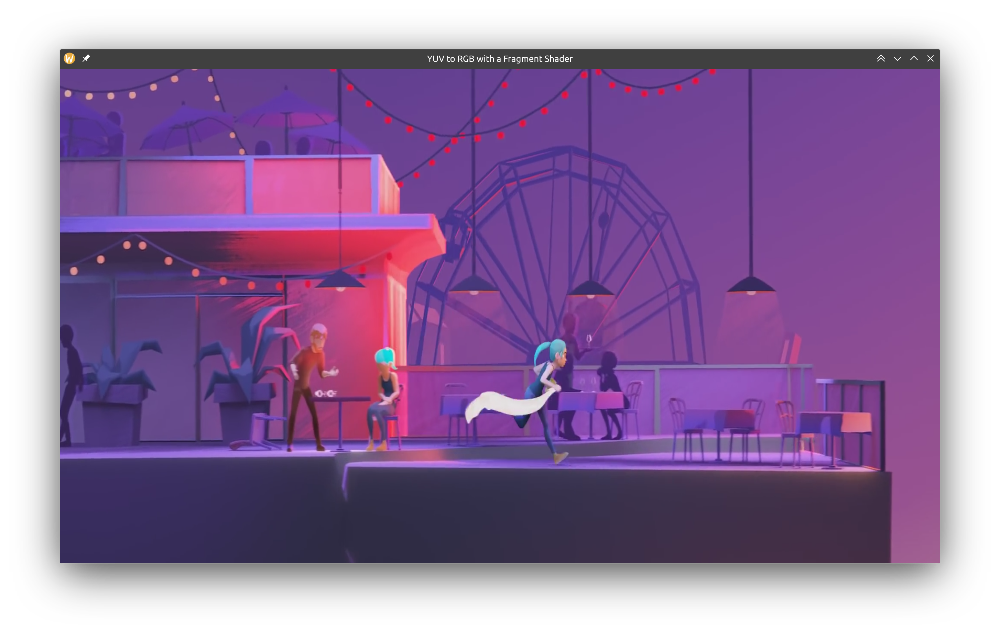

# QtYuv

This is a test I made on converting yuv420p frames to rgb with the GPU by using a fragment shader. The code currently only works on Qt5; porting it to Qt6 requires a few changes to be less OpenGL specific, but the concept should not change.



# How to Run

Create a yuv420p stream with a command like this (demo file is included in the repo):

```
ffmpeg -i coffee_run.mkv -pix_fmt yuv420p -f rawvideo coffee_run.raw
```

then build the app using cmake:

```
mkdir build
cd build
cmake ..
make
```

and run it:

```
./Qt5Yuv ../coffee_run.raw 2048x858 24
```